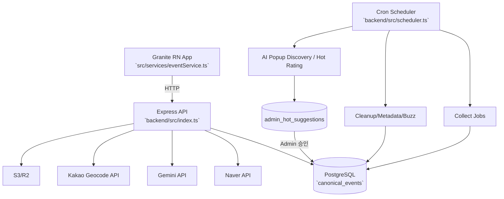

# ARCHITECTURE

Last Updated: 2026-02-09

## 1) 시스템 개요
- 사용자 앱은 Granite RN 앱이며 엔트리는 `index.ts` → `src/_app.tsx`입니다. Source: `index.ts`, `src/_app.tsx`
- 백엔드는 Express 단일 서버이며 엔트리는 `backend/src/index.ts`입니다. Source: `backend/src/index.ts`
- Admin API/Public API/스케줄러 초기화가 동일 프로세스에서 동작합니다. Source: `backend/src/index.ts`, `backend/src/scheduler.ts`

## 2) 런타임 구성
- Frontend runtime
  - 앱 실행: `npm run dev` (`granite dev`) Source: `package.json`
  - 라우팅 파일: `pages/**` (실제 라우트 엔트리), 구현 파일: `src/pages/**`
  - 재-export 예시: `pages/index.tsx` → `src/pages/index.tsx`, `pages/explore.tsx` → `src/pages/explore.tsx`, `pages/admin.tsx` → `src/pages/admin.tsx`
  - 직접 구현 예시: `pages/events/[id].tsx`
  - 디렉토리 근거: `pages/`와 `src/pages/`가 동시에 존재
  Source: `pages/index.tsx`, `pages/explore.tsx`, `pages/admin.tsx`, `pages/events/[id].tsx`, `pages/`, `src/pages/`
- Backend runtime
  - 개발 실행: `npm run dev` (기본 `PORT=5001`) Source: `backend/package.json`
  - 서버 바인딩: `0.0.0.0:${PORT}` (`PORT` 기본 4000, 스크립트에서 5001 주입) Source: `backend/src/index.ts`, `backend/package.json`
  - 헬스체크: `GET /health` Source: `backend/src/index.ts`

## 3) 요청 처리 흐름
### 3-1. Public 이벤트 조회
1. 클라이언트 `eventService`가 `/events`, `/events/hot`, `/events/ending`, `/events/new`, `/events/recommend`, `/events/nearby` 호출 Source: `src/services/eventService.ts`
2. Express 라우트가 `canonical_events`를 조회하고 pageInfo와 함께 응답 Source: `backend/src/index.ts`
3. 프론트에서 맵핑/정규화 후 카드 렌더 Source: `src/services/eventService.ts`

### 3-2. Admin 수정/생성
1. Admin API는 기본적으로 `x-admin-key` 인증 미들웨어 적용 (`/admin/verify`, `/admin/metrics` 제외) Source: `backend/src/index.ts`, `ADMIN_API_REFERENCE.md`
2. 이벤트 수정/생성 시 `canonical_events` 업데이트 및 일부 비동기 후처리(enrich) 트리거 Source: `backend/src/index.ts`, `ADMIN_API_REFERENCE.md`

### 3-3. 스케줄러
1. 서버 부팅 시 `initScheduler()` 호출 Source: `backend/src/index.ts`
2. `ENABLE_SCHEDULER=true`일 때만 cron 등록 Source: `backend/src/scheduler.ts`
3. 수집/정리/메타데이터/추천/AI 발굴 배치 실행 Source: `backend/src/scheduler.ts`

## 4) 데이터 흐름 다이어그램

## 5) 주요 데이터 모델 (핵심)
- `canonical_events`
  - 핵심: `title`, `display_title`, `content_key`, `start_at`, `end_at`, `venue`, `region`, `main_category`, `sub_category`, `image_url` Source: `backend/src/db.ts`
  - JSONB: `external_links`, `source_tags`, `derived_tags`, `quality_flags`, `opening_hours`, `metadata`, `manually_edited_fields`, `ai_suggestions`, `field_sources`, `image_metadata` Source: `backend/migrations/20260126_add_common_fields_phase1.sql`, `backend/migrations/20260130_add_metadata_for_phase2.sql`, `backend/migrations/20260130_add_manually_edited_fields.sql`, `backend/migrations/20260131_add_ai_suggestions.sql`, `backend/migrations/20260123_add_image_metadata.sql`
- `collection_logs`
  - 수집/배치 실행 로그(`source`, `type`, `status`, `started_at`, `completed_at`) Source: `backend/migrations/20251227_admin_automation_logging.sql`
- `image_audit_log`
  - 이미지 업로드/삭제/DMCA 감사 로그 Source: `backend/migrations/20260123_add_image_metadata.sql`
- 기타 이벤트 행동/추천 테이블
  - `event_views`, `event_actions`, `user_events`, `user_preferences` 사용 흔적 존재 Source: `backend/migrations/20251223_add_event_views_fixed.sql`, `backend/migrations/20260120_add_buzz_score_infrastructure.sql`, `backend/src/index.ts`

## 6) 외부 의존성 및 ENV 키
- DB: `DB_HOST`, `DB_PORT`, `DB_USER`, `DB_PASSWORD`, `DB_NAME`, `DATABASE_URL` Source: `backend/src/config.ts`, `backend/src/db.ts`
- Naver Search: `NAVER_CLIENT_ID`, `NAVER_CLIENT_SECRET` Source: `backend/src/lib/naverApi.ts`
- Kakao Geocode: `KAKAO_REST_API_KEY` Source: `backend/src/config.ts`, `backend/src/lib/geocode.ts`
- Gemini: `GEMINI_API_KEY`, `GEMINI_MODEL` Source: `backend/src/lib/aiExtractor.ts`
- OpenAI(일부 기능): `OPENAI_API_KEY` Source: `backend/src/config.ts`, `backend/src/index.ts`
- KOPIS: `KOPIS_API_KEY` Source: `backend/src/lib/kopisApi.ts`
- 이미지 저장: `S3_ENDPOINT`, `S3_ACCESS_KEY`, `S3_SECRET_KEY`, `S3_BUCKET`, `AWS_REGION`, `CDN_BASE_URL` Source: `backend/src/config.ts`, `backend/src/lib/imageUpload.ts`
- 스케줄/운영: `ENABLE_SCHEDULER`, `ENABLE_FAILSAFE`, `FAILSAFE_CRON`, `FAILSAFE_STUCK_MINUTES`, `ADMIN_KEY`, `PORT` Source: `backend/src/scheduler.ts`, `backend/src/maintenance/cleanupStuckCollectionLogs.ts`, `backend/src/index.ts`

## 7) 위험/비용/레이트리밋 포인트
- 비용 고위험
  - AI 추출/제안 관련 엔드포인트: Gemini 호출량 증가 가능 Source: `ADMIN_API_REFERENCE.md`, `backend/src/lib/aiExtractor.ts`
- 레이트리밋/외부 API 실패
  - Naver 검색 API, Kakao Geocoding, Nominatim fallback Source: `backend/src/lib/naverApi.ts`, `backend/src/lib/geocode.ts`
- 업로드 보안/운영
  - `/admin/uploads/image`는 rate limit(15분/20회) + admin key 필요 Source: `backend/src/index.ts`
- 데이터 보호
  - `manually_edited_fields`로 AI overwrite 방지 정책 존재 Source: `backend/migrations/20260130_add_manually_edited_fields.sql`, `ADMIN_API_REFERENCE.md`

## 8) 확인 필요 TODO
- TODO: Root `README.md`가 1줄(`Granite App`)만 있어 실제 운영 run command/아키텍처 설명이 부족합니다. Source: `README.md`
- TODO: `backend/README.md`의 기본 포트(4000) 설명은 최신 dev 스크립트(5001)와 불일치합니다. Source: `backend/README.md`, `backend/package.json`
- TODO: `pages/`와 `src/pages/` 혼재 구조의 우선 적용 규칙을 공식 문서화할 필요가 있습니다. Source: `pages/`, `src/pages/`
